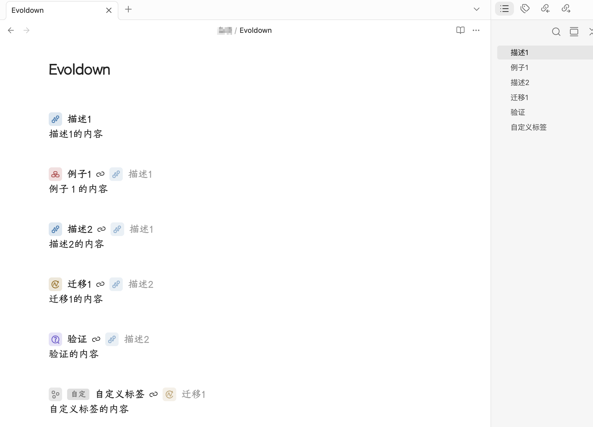

# obsidian-evoldown-plugin

[简体中文](README.md) | English

Adds Evoldown syntax support to Obsidian with five custom tags: `#d`, `#e`, `#t`, `#v`, and `#c`.



## Installation

Requires Obsidian 1.5.7 or later. Download `evoldown.zip` from Releases, extract it, and place the `evoldown` folder in your vault's `.obsidian/plugins/` directory. Enable Evoldown under **Settings → Community plugins**.

To update, replace the plugin files and disable and re-enable the plugin.

## Syntax

- `#d` description, `#e` example, `#t` transfer, `#v` verification: `#letter Title [ReferencedTitle]`
- `#c` custom tag: `#c TagName Title [ReferencedTitle]`

The referenced title is optional. Enclose fields containing spaces in single or double quotes. Body content continues until the next heading or the end of the file.

```markdown
#d Description1
Content for Description1.

#e Example1 Description1
Content for Example1.

#d Description2 Description1
Content for Description2.

#t Transfer1 Description2
Content for Transfer1.

#v Verification Description2
Content for Verification.

#c TagName Title Transfer1
Content for the custom tag.
```

## Usage

- Supports Reading view and Live Preview. In Live Preview, click a title, type icon, or custom tag to edit it.
- Click a referenced title to jump to its heading in the current note. If multiple headings share a title, the first match is used.
- Choose a heading level from H1–H6 under **Settings → Evoldown**. The default is H6.
- Open **Outline** to display custom headings at the selected level and click entries to navigate to them.
- Use Obsidian’s native **Export to PDF** to preserve Evoldown headings, icons, custom tags, and reference styling. References in the PDF are visual only; plugin navigation is not available.

## Development

Requires Node.js 18 or later. No dependency installation is needed.

```sh
npm test
npm run build
```

Build output is placed in `dist/evoldown/`.
